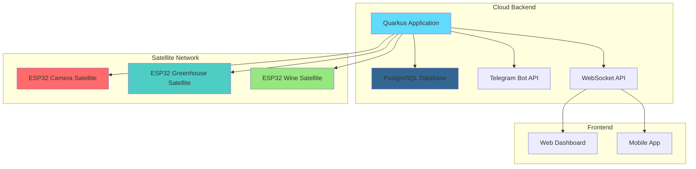
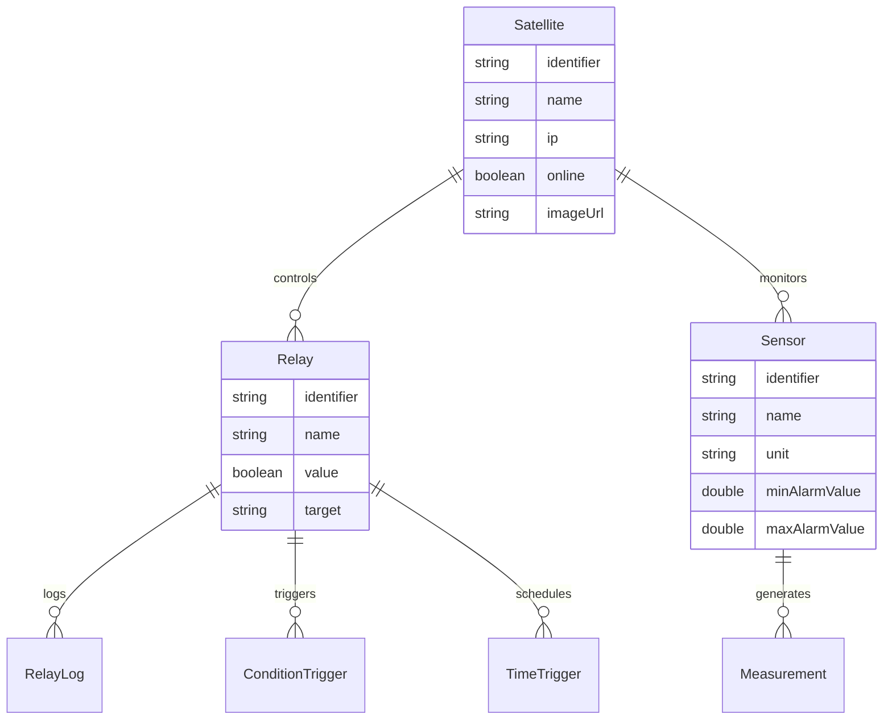

# 🌱 Greenhouse Backend

<div align="center">


**A smart greenhouse automation system built with modern Java technology**

[](https://dl.circleci.com/status-badge/redirect/gh/hablijack/greenhouse-backend/tree/main)
[](https://opensource.org/licenses/MIT)
[](https://openjdk.java.net/)
[](https://quarkus.io/)

</div>

## 🌿 Overview

The Greenhouse Backend is a comprehensive IoT system for automating greenhouse operations including watering, plant lighting, and climate control. It features a distributed satellite architecture with ESP32 microcontrollers, real-time monitoring, and intelligent automation capabilities.

## 🏗️ Architecture



### Core Components

- **🌐 REST API**: Full-featured RESTful API with OpenAPI documentation
- **🔌 WebSocket Support**: Real-time data streaming for live monitoring
- **📡 Satellite Communication**: HTTP-based communication with ESP32 nodes
- **🤖 Telegram Integration**: Automated notifications and remote control
- **⏰ Smart Scheduling**: Time-based and condition-based automation
- **📊 Data Analytics**: Historical data tracking and visualization

## 🛠️ Technology Stack

| Component | Technology | Version |
|-----------|------------|---------|
| **Runtime** | Quarkus | 3.30.1 |
| **Language** | Java | 25 |
| **Database** | PostgreSQL | Latest |
| **Build Tool** | Maven | 3.9+ |
| **Container** | Docker | Latest |
| **Testing** | JUnit 5, REST Assured | Latest |
| **Code Quality** | SpotBugs, PMD, Checkstyle | Latest |

### Key Features

- ✅ **Native Compilation** with GraalVM for ultra-fast startup
- ✅ **Reactive Programming** with SmallRye Mutiny
- ✅ **Security** with JWT authentication
- ✅ **Health Checks** with MicroProfile Health
- ✅ **OpenAPI Documentation** with Swagger UI
- ✅ **Database Migrations** with Hibernate ORM
- ✅ **Scheduled Tasks** with Quarkus Scheduler

## 🚀 Quick Start

### Prerequisites

- Java 25+
- Maven 3.9+
- Docker & Docker Compose
- PostgreSQL 14+

### Development Setup

1. **Clone the repository**
   ```bash
   git clone https://github.com/hablijack/greenhouse-backend.git
   cd greenhouse-backend
   ```

2. **Install dependencies**
   ```bash
   mvn clean install
   ```

3. **Start development server**
   ```bash
   ./mvnw compile quarkus:dev
   ```

   The application will be available at `http://localhost:8080`

4. **Access API Documentation**
   - Swagger UI: `http://localhost:8080/q/swagger-ui`
   - OpenAPI JSON: `http://localhost:8080/q/openapi`

### Docker Deployment

1. **Build the application**
   ```bash
   mvn clean package -DskipTests
   ```

2. **Build Docker image**
   ```bash
   docker build -f src/main/docker/Dockerfile.jvm -t greenhouse-backend .
   ```

3. **Run with Docker Compose**
   ```bash
   docker-compose up -d
   ```

## 📡 Satellite Architecture

The system uses a distributed satellite architecture where ESP32 microcontrollers handle physical sensor readings and actuator control:

### Satellite Types

| Satellite | Purpose | Key Features |
|-----------|---------|--------------|
| **🌸 Greenhouse Satellite** | Main greenhouse control | Temperature, humidity, soil moisture, lighting, watering control |
| **📷 Camera Satellite** | Visual monitoring | Camera integration |
| **🍷 Wine Satellite** | Wine plants monitoring | Temperature control, humidity monitoring |

### Communication Protocol

Satellites communicate via HTTP REST API:
- **POST** `/api/satellite/{id}/measurement` - Submit sensor data
- **GET** `/api/satellite/{id}/relays` - Get relay states
- **POST** `/api/satellite/{id}/relay/{relayId}` - Control relays

## 📊 Data Model

### Core Entities



## 🔧 Configuration

### Environment Variables

| Variable | Description | Default |
|----------|-------------|---------|
| `DB_HOST` | PostgreSQL host | `localhost` |
| `DB_USER` | Database username | `greenhouse` |
| `DB_PASSWORD` | Database password | - |
| `TELEGRAM_TOKEN` | Telegram bot token | - |
| `TELEGRAM_CHATID` | Telegram chat ID | - |

### Application Properties

Key configuration options in `application.properties`:

```properties
# Database Configuration
quarkus.datasource.db-kind=postgresql
quarkus.datasource.jdbc.url=jdbc:postgresql://localhost:5432/greenhouse

# CORS Configuration
quarkus.http.cors=true
quarkus.http.cors.origins=http://localhost:3000

# WebSocket Configuration
quarkus.websocket.dispatch-to-worker=true
```

## 📱 API Endpoints

### Authentication
- `POST /api/auth/login` - User authentication
- `POST /api/auth/refresh` - Token refresh

### Sensors
- `GET /api/sensors` - List all sensors
- `GET /api/sensors/{id}/measurements` - Get sensor data
- `WebSocket /api/sensors/measurements` - Real-time data stream

### Relays
- `GET /api/relays` - List all relays
- `POST /api/relays/{id}/toggle` - Toggle relay state
- `WebSocket /api/relays/logs` - Real-time relay logs

### Satellites
- `GET /api/satellites` - List all satellites
- `POST /api/satellites/{id}/heartbeat` - Satellite health check

## 🧪 Testing

### Run Tests
```bash
# Unit tests
mvn test

# Integration tests
mvn verify

# Native tests
mvn verify -Pnative
```

### Code Quality
```bash
# SpotBugs analysis
mvn spotbugs:check

# PMD analysis
mvn pmd:check

# Checkstyle
mvn checkstyle:check
```

## 📈 Monitoring & Health

### Health Checks
- **Application Health**: `/q/health`
- **Database Health**: `/q/health/db`
- **Satellite Health**: `/q/health/satellites`

### Metrics
- **Prometheus Metrics**: `/q/metrics`
- **Application Stats**: `/q/health/application`

## 🚀 Production Deployment

### Native Image
```bash
mvn clean package -Pnative
```

## 🤝 Contributing

1. Fork the repository
2. Create a feature branch (`git checkout -b feature/amazing-feature`)
3. Commit your changes (`git commit -m 'Add amazing feature'`)
4. Push to the branch (`git push origin feature/amazing-feature`)
5. Open a Pull Request

### Development Guidelines

- Follow Java coding conventions
- Write unit tests for new features
- Update documentation
- Ensure code quality checks pass

## 📄 License

This project is licensed under the MIT License - see the [LICENSE](LICENSE) file for details.

## 🙏 Acknowledgments

- **Quarkus Team** - For the amazing framework
- **ESP32 Community** - For the embedded platform
- **PostgreSQL Team** - For the reliable database
- **Docker Team** - For containerization technology

---

<div align="center">

**🌱 Made with ❤️ for smart gardening 🌱**

[](#greenhouse-backend)

</div>